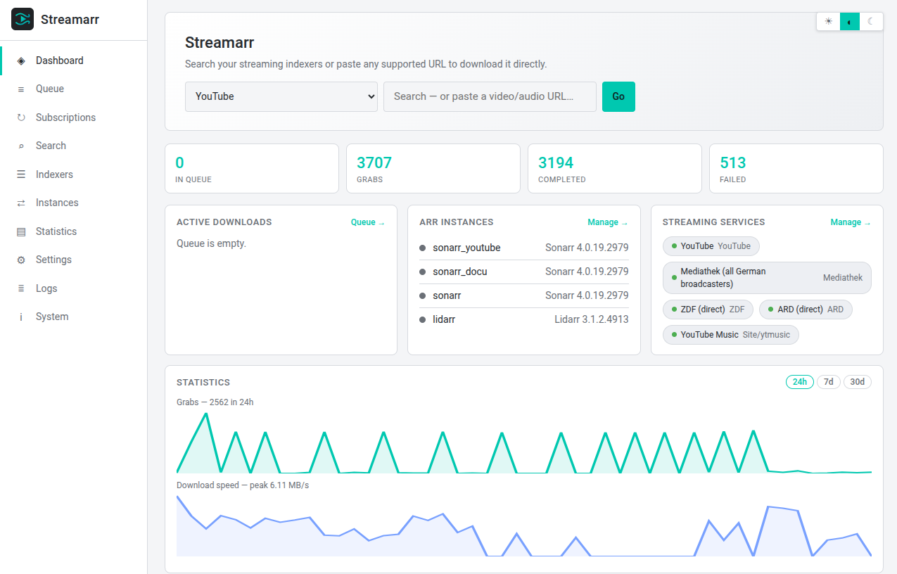
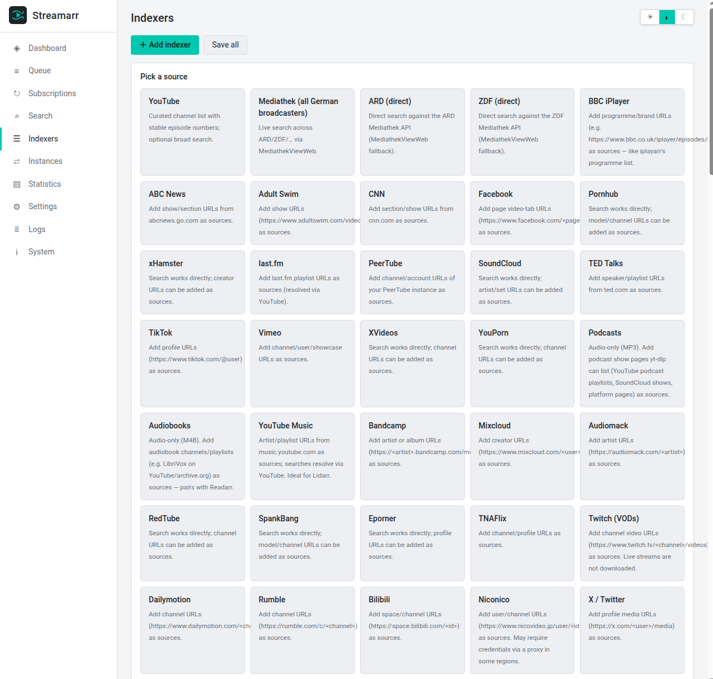
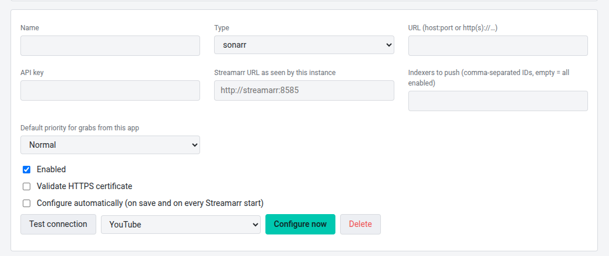
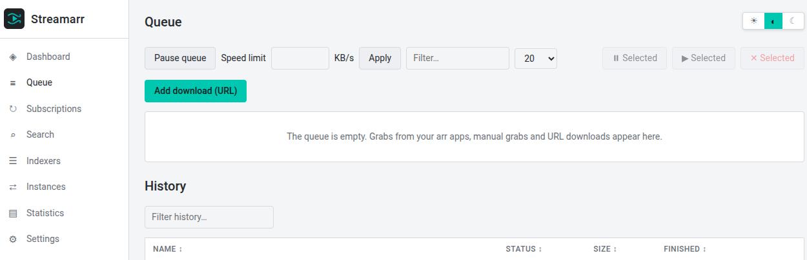
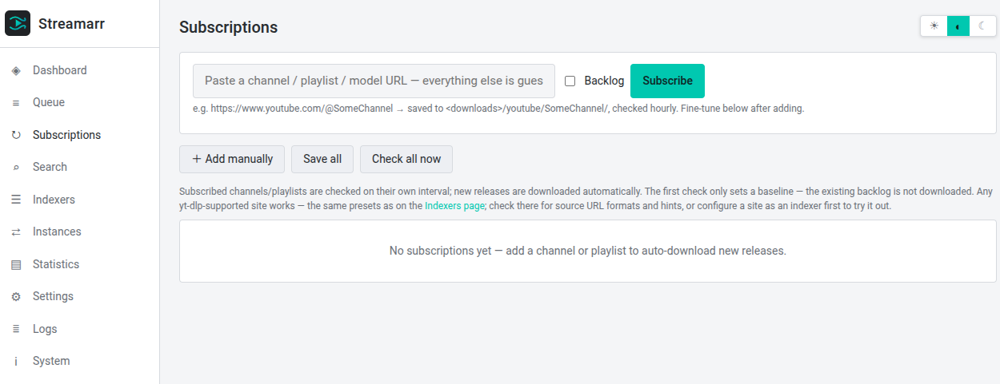

# Streamarr

    

**Download streaming content with your *arr apps — as if it came from Usenet.**

Streamarr looks like a **Newznab indexer** and a **SABnzbd download client** to Sonarr, Radarr, Lidarr, Readarr, Whisparr and Prowlarr — but behind the scenes it fetches from **YouTube**, the **German public-broadcast Mediathek** (ARD/ZDF/…) and **35+ other yt-dlp-supported sites** (Twitch, Bandcamp, SoundCloud, Pornhub, TikTok, Dailymotion, …). Your arr apps search, grab, rename and import exactly like they do with Usenet — no new workflow to learn.

```
┌────────┐  Newznab search   ┌───────────┐  yt-dlp / HTTPS  ┌────────────────┐
│ Sonarr │ ────────────────► │           │ ───────────────► │ YouTube        │
│ Radarr │  SABnzbd "grab"   │ Streamarr │                  │ Mediathek      │
│ Lidarr │ ────────────────► │           │ ◄─── media ───── │ 35+ sites      │
└────────┘  import /downloads└───────────┘                  └────────────────┘
```


*Dashboard — search or paste a URL, live downloads, instance health*

## Why Streamarr?

- **Zero-workflow integration** — your arrs treat it as a normal indexer + download client. Automatic search, quality profiles, renaming and library imports all just work.
- **One-URL subscriptions** — paste `https://www.youtube.com/@SomeChannel` and Streamarr guesses everything: provider, name, storage path (`/downloads/youtube/SomeChannel/`), and starts checking hourly. Pinchflat-style, but arr-aware.
- **Real episode identities** — Streamarr asks your Sonarr which episode `S2026E17` actually is and matches it by *title*, so even TVDB's year-season YouTube series import correctly.
- **It's your box** — open by default, optional login, no password rules, no telemetry.

## Quick start

```yaml
# docker-compose.yml
services:
  streamarr:
    image: makearr/streamarr:latest   # build: docker build -t streamarr:latest .
    container_name: streamarr
    restart: unless-stopped   # required for yt-dlp self-update restarts
    ports:
      - "8585:8585"
    environment:
      - PUID=1000
      - PGID=1000
      - TZ=Europe/Berlin
    volumes:
      - ./config:/config
      - /path/to/downloads:/downloads   # same path your arr apps import from
```

```bash
docker compose up -d streamarr
```

Open `http://<host>:8585` — done. No mandatory login, no setup wizard.

## Three steps to your first import

**1. Add an indexer** — pick a preset (YouTube, ZDF, Twitch, …), Streamarr fills in the rest.


*Preset cards with per-indexer quality and categories*

**2. Connect your arr** — add the instance with its URL + API key and enable *Auto-configure*. Streamarr pushes itself into the arr as indexer **and** download client, guessing its own reachable URL and letting the arr's validation confirm it.


*One click configures indexer + download client in the arr*

**3. Search in your arr** — grab an episode; it appears in Streamarr's queue, downloads via yt-dlp in your configured quality, and the arr imports it under the exact name it expects.


*Sortable queue with priorities, speed, ETA and bulk actions*

## Subscriptions (no arr required)

Paste a channel / playlist / model URL, get automatic downloads:


*URL quick-add: provider, name and path are guessed*

- `https://www.youtube.com/@HybridCalisthenics` → `/downloads/youtube/HybridCalisthenics/`
- `https://www.pornhub.com/model/example` → `/downloads/pornhub/example/`
- First check runs immediately; by default only **new** uploads download (tick *Backlog* to fetch everything)
- Per subscription: storage path, check interval, priority, quality, naming, and optional cross-check against your arrs so already-imported content is skipped

## What's inside

| Area | Details |
|---|---|
| Providers | YouTube (channels + search), MediathekViewWeb, ARD/ZDF direct, 35+ site presets, fully custom yt-dlp mode |
| Indexer API | `/newznab/<id>/api` — caps, search, tvsearch (incl. season → per-episode expansion), movie, music (artist/album), book |
| Download client | `/sabnzbd/api` — queue, history, addfile, pause/resume, priorities (Force → Lowest), speed limit |
| Music | Lidarr-ready: music grabs are auto-extracted to audio (MP3/M4A/…), YouTube Music preset included |
| Quality | Global + per-indexer caps (resolution, FPS, container, audio codec); sort-based yt-dlp selection that never silently drops to 480p |
| Naming | `absolute`, `sxxeyy`, `date`, `auto`, `arr` (episode identity resolved from the upstream arr) — releases tagged `-Streamarr` |
| Statistics | Dashboard graphs (grabs + speed, 24h/7d/30d), per-indexer stats, Prometheus `/metrics` |
| Security | Optional login (never / outside local networks / always), browser-side SHA-256 password transport, masked API keys, secure cookies behind HTTPS, hardened headers, 0600 config |
| Maintenance | yt-dlp self-update (waits for idle, restarts), browser impersonation against 403-blocking sites, rate limiting with exponential backoff, backup/restore from the UI |

## Configuration

Everything lives in the UI (Settings); the file behind it is `/config/config.yml`. Frequently asked knobs:

| Setting | Where | Default |
|---|---|---|
| Port | Settings → General (restart + adjust port mapping) | `8585` |
| Download path | Settings → Downloads | `/downloads` |
| Quality caps | Settings → Quality, overridable per indexer | 1080p / 60 fps / mp4 |
| Login | Settings → Security | open |
| yt-dlp auto-update | Settings → yt-dlp | on, daily |
| Subscriptions interval | per subscription | 60 min |

## FAQ

**Do I need Usenet or a torrent client?** No. The "NZB" is a stub that carries Streamarr metadata; the actual download is yt-dlp over HTTPS.

**Sonarr says "no results in the configured categories".** Make sure the indexer's categories match the arr (TV = 5000-range). The arr's test query without a search term is answered with the latest entries, so a working setup always passes.

**Why did my grab download at 480p?** It shouldn't — selection is sort-based and prefers your cap. Check the log line `Downloaded format for '…'`; if a site genuinely offers nothing better, that's what it says.

**A site returns HTTP 403.** Browser impersonation (curl_cffi) is enabled by default and covers most cases; check the log for `browser impersonation available`. Some sites additionally need a proxy (Settings → Proxy).

## Contributing

Issues and pull requests are welcome. Please attach logs (Logs page → Copy log) to bug reports — Streamarr logs every incoming arr request and every provider response, which makes most issues diagnosable from a single paste. Development notes live in `docs/HANDOFF.md`. Run the test suite with `python3 -m pytest` (111 tests, no network required).

## License

[GPL-3.0](LICENSE)

## Disclaimer

Streamarr automates downloads of publicly available streaming content for personal use. Respect the terms of service of the platforms you use and the copyright laws of your jurisdiction.
